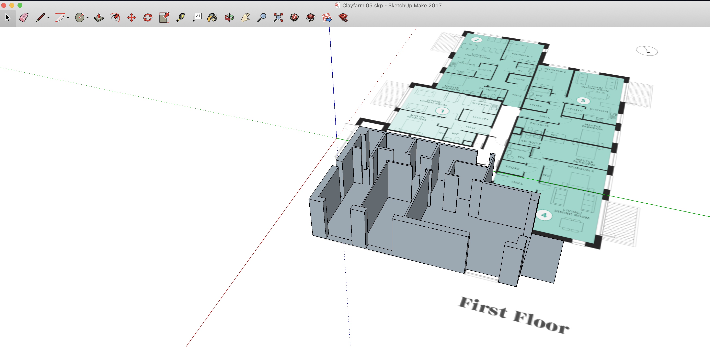

3D model your flat
====

1. Dowload Google Sketchup from their [web](https://www.sketchup.com/)
2. Create a new file using meters template
3. Import the plans of the home from [github](./3dmodeling/floorplan_maple_01.png) if you need any other floor I can explain  hot to get them.
4. Create the walls following the lines of the walls of the flat.
5. Scale up/down until the area of the flat has the same as the specs of your flat.

You can download a sample of apt 5 [here](./3dmodeling/Clayfarm05.skp)
Sample: 

